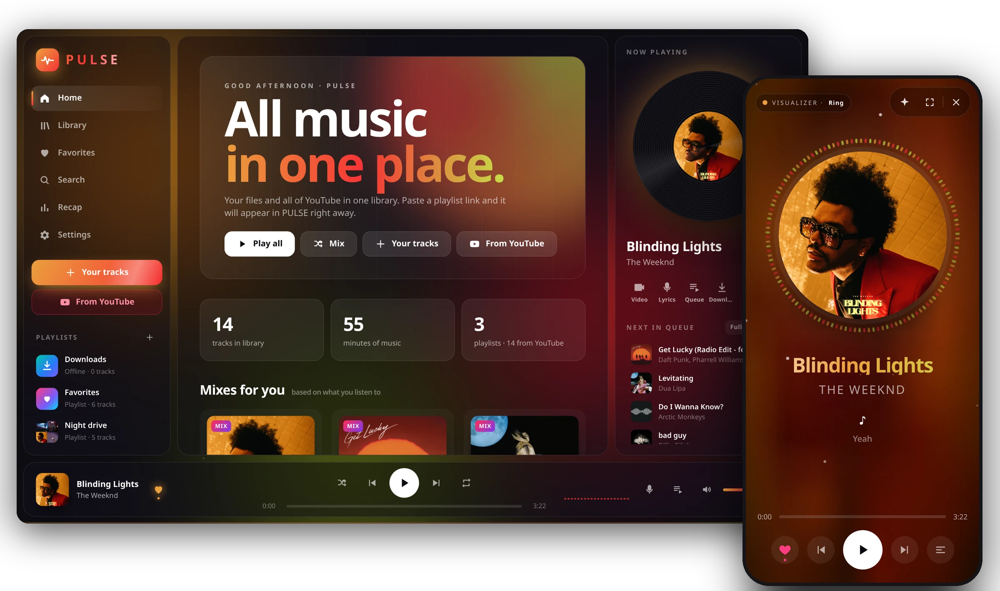
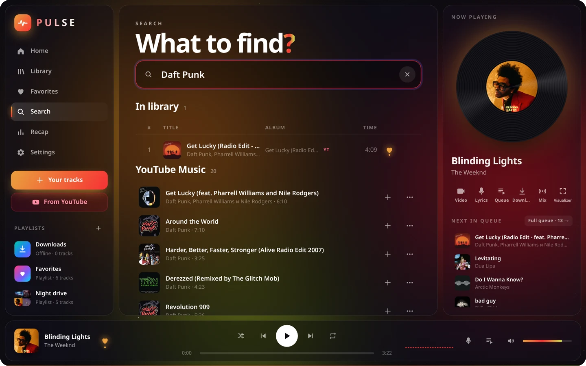
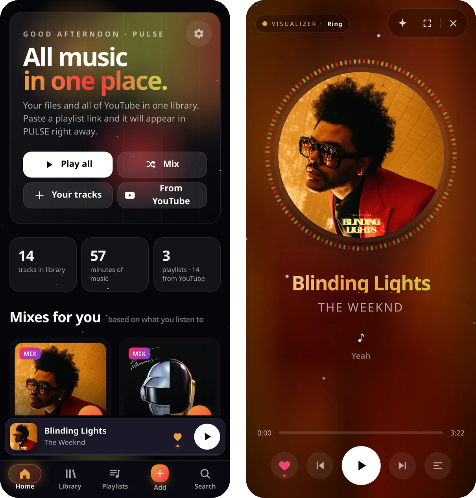
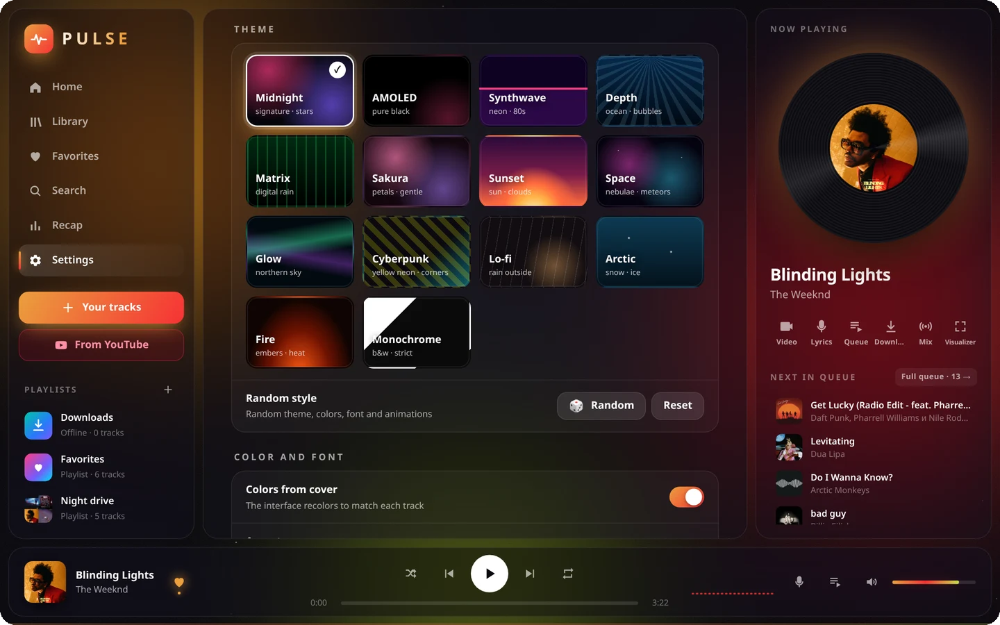

<b>English</b> · <a href="README.uk.md">Українська</a> · <a href="README.ru.md">Русский</a>

# PULSE

A music player I made because I never found one that felt like mine.

I tried so many of them, and something was always off. One had no smooth transitions between tracks. Another had them, but was missing the features I'd got used to in the first one. A third could do almost everything, but looked like you didn't really want to use it. I ended up juggling three players, and none of them was quite right.

So I decided to put everything I was missing in one place. That's how PULSE happened.

Free · <a href="https://github.com/shadow1-ui/PULSE-Music-app/releases/latest">latest version</a>

---

## What it does

**Your music and YouTube, together.** Drop in your own mp3 or flac files and search for any track on YouTube or YouTube Music. It all lives in one library and the same playlists, no matter where a track came from.

**Play one track and it keeps going.** Start a song from search and a mix of similar tracks follows. When the queue runs out, Automix picks something similar instead of leaving you in silence.

**DJ-style transitions.** There's a regular crossfade, and there's Smart transition. On your own files it finds where a track really ends, matches the beat and blends the bass smoothly. On YouTube it uses the lyrics to see where the vocals end, so you don't sit through a minute of music video credits.

**Listen offline.** Download tracks or whole playlists from YouTube and play them on the subway, on a plane, anywhere.

**Your phone and PC stay in sync.** Sign in, and your library, playlists, Favorites and look are the same everywhere. Add a track on your phone and it's already on your PC.

**Make it yours.** Or don't, it looks good out of the box too. But if you feel like it:
- 14 themes (from AMOLED and Monochrome to Synthwave, Matrix and Sakura);
- the interface takes its colors from the current album cover;
- set your own wallpaper: an image or a video;
- six visualizer styles, splash screens, custom fonts, animations, a pulse that beats with the music.

Can't decide? Hit 🎲 and it'll put together a random style for you.

&nbsp;&nbsp;

**Also:** lyrics, sleep timer, Recap with your listening stats, Discord status, mini player and tray mode on Windows. The interface speaks English, Ukrainian and Russian.

---

## How to install

**Android.** Download `PULSE.x.x.x.apk` from [Releases](https://github.com/shadow1-ui/PULSE-Music-app/releases/latest) and open it. If your phone asks about installing from an unknown source, allow it.

**Windows.** Download `PULSE-Setup-x.x.x.exe` and run it. If a blue Windows window pops up, click "More info" → "Run anyway".

**Browser.** Just open the [web version](https://music.pulse-apps.workers.dev), nothing to install.

No need to update by hand: PULSE notices a new version on its own and offers to install it.

---

## A few honest words

I make PULSE on my own, in my free time. Something might break here and there. If you find a bug or have an idea, open an [Issue](https://github.com/shadow1-ui/PULSE-Music-app/issues), I really do read everything.

If you like the player, give this repo a ⭐. It's a small thing, but it helps more people find PULSE.
