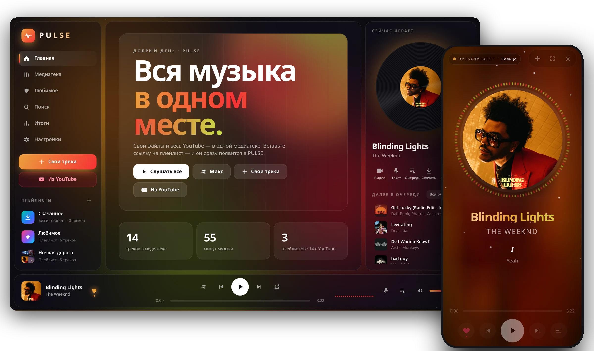
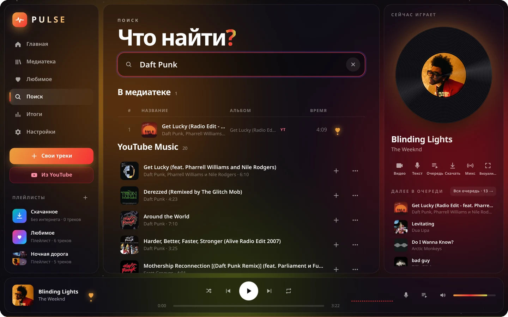
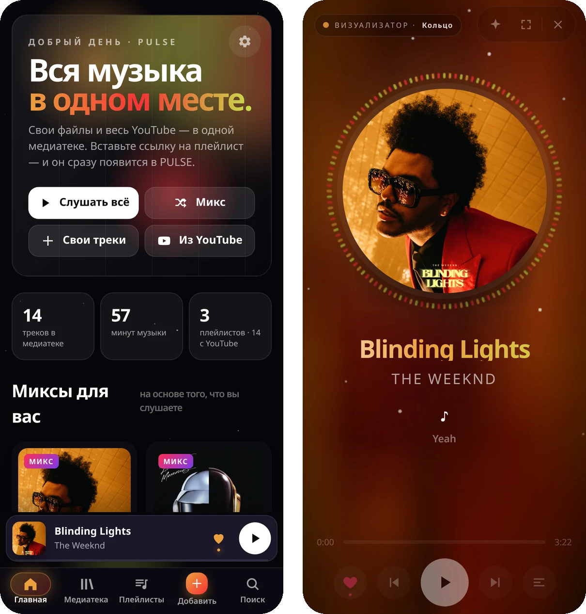
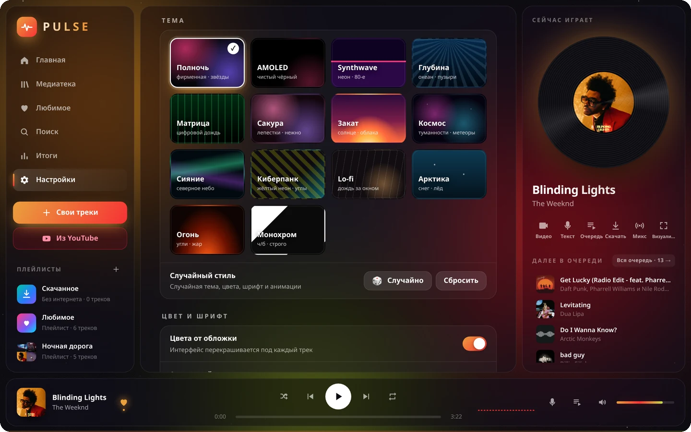

<a href="README.md">English</a> · <a href="README.uk.md">Українська</a> · <b>Русский</b>

# PULSE

Музыкальный плеер, который я сделал, потому что так и не нашёл свой.

Сколько я их перепробовал — всё время было что-то не то. В одном нет плавного перехода между треками. В другом переход есть, но нет функций, к которым я привык в первом. Третий умеет почти всё, но выглядит так, что пользоваться им не хочется. В итоге я сидел с тремя плеерами и ни один меня полностью не устраивал.

Поэтому я решил собрать всё, чего мне не хватало, в одном месте. Так появился PULSE.

Бесплатно · <a href="https://github.com/shadow1-ui/PULSE-Music-app/releases/latest">последняя версия</a>

---

## Что он умеет

**Своя музыка и YouTube вместе.** Закидываете свои mp3 или flac, а в поиске ищете любой трек с YouTube или YouTube Music. Всё лежит в одной медиатеке и в одних плейлистах, без разницы, откуда трек.

**Включил один трек — дальше играет само.** После трека из поиска запускается микс похожих. Если очередь закончилась, автомикс подбирает что-то похожее, а не обрывает музыку тишиной.

**Переходы как у диджея.** Есть обычный кроссфейд, а есть «умный переход». На своих файлах он находит, где трек на самом деле заканчивается, подстраивается под ритм и аккуратно сводит басы. На YouTube смотрит по тексту песни, где закончился вокал, и не заставляет слушать минуту титров из клипа.

**Слушать без интернета.** Треки и целые плейлисты с YouTube можно скачать и слушать в метро, в самолёте или где угодно.

**Телефон и ПК знают друг о друге.** Войдите в аккаунт, и медиатека, плейлисты, «Любимое» и оформление будут одинаковыми везде. Добавили трек на телефоне — он уже на компе.

**Его можно настроить под себя.** А можно и не настраивать, по умолчанию он тоже выглядит хорошо. Но если хочется:
- 14 тем (от AMOLED и Монохрома до Synthwave, Матрицы и Сакуры);
- цвета интерфейса подстраиваются под обложку текущего трека;
- можно поставить свои обои: картинку или видео;
- шесть стилей визуализатора, заставки при запуске, свои шрифты, анимации, пульс в такт музыке.

Если лень выбирать, есть кнопка 🎲: она сама соберёт случайный стиль.

&nbsp;&nbsp;

**И ещё:** текст песни, таймер сна, «Итоги» со статистикой прослушиваний, статус в Discord, мини-плеер и трей на Windows. Интерфейс на русском, украинском и английском.

---

## Как установить

**Android.** Скачайте `PULSE.x.x.x.apk` из [релизов](https://github.com/shadow1-ui/PULSE-Music-app/releases/latest) и откройте. Если телефон спросит про установку из неизвестного источника, разрешите.

**Windows.** Скачайте `PULSE-Setup-x.x.x.exe` и запустите. Если появится синее окно Windows, нажмите «Подробнее» → «Выполнить в любом случае».

**Браузер.** Просто откройте [веб-версию](https://music.pulse-apps.workers.dev), ничего ставить не нужно.

Обновлять вручную не нужно: PULSE сам заметит новую версию и предложит её поставить.

---

## Пара честных слов

PULSE я делаю один, в свободное время. Где-то может что-то сломаться. Если нашли баг или есть идея, пишите в [Issues](https://github.com/shadow1-ui/PULSE-Music-app/issues), я правда всё читаю.

Если плеер понравился, поставьте ⭐ этому репозиторию. Это мелочь, но так PULSE заметит больше людей.
