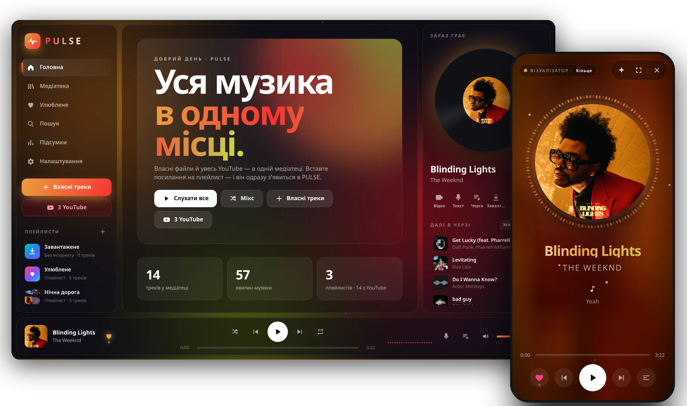
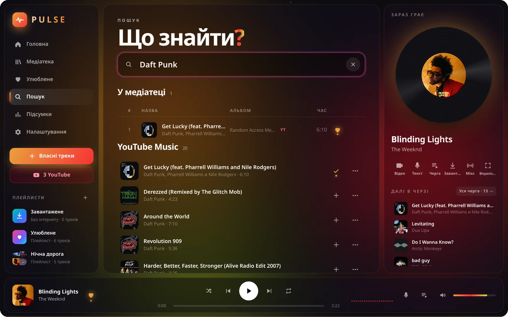
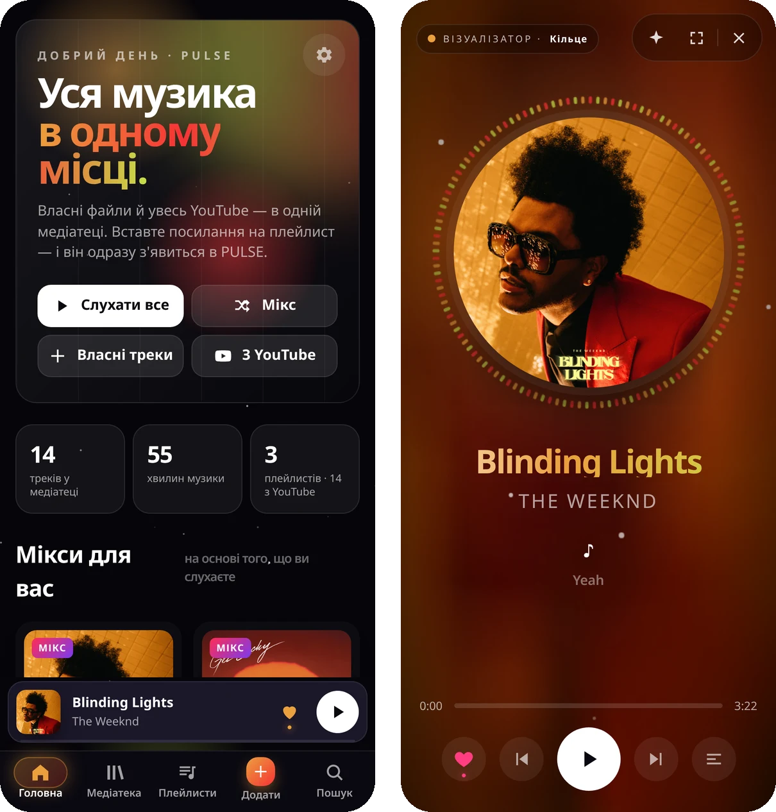
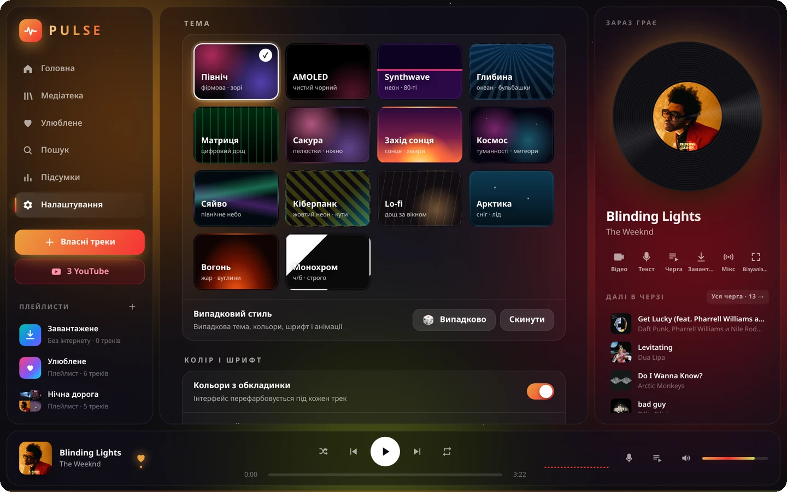

<a href="README.md">English</a> · <b>Українська</b> · <a href="README.ru.md">Русский</a>

# PULSE

Музичний плеєр, який я зробив, бо так і не знайшов свій.

Скільки я їх перепробував — постійно було щось не те. В одному немає плавного переходу між треками. В іншому перехід є, але немає функцій, до яких я звик у першому. Третій уміє майже все, але виглядає так, що користуватися ним не хочеться. Зрештою я сидів із трьома плеєрами, і жоден мене повністю не влаштовував.

Тому я вирішив зібрати все, чого мені бракувало, в одному місці. Так з'явився PULSE.

Безкоштовно · <a href="https://github.com/shadow1-ui/PULSE-Music-app/releases/latest">остання версія</a>

---

## Що він уміє

**Своя музика і YouTube разом.** Закидаєте свої mp3 чи flac, а в пошуку шукаєте будь-який трек із YouTube або YouTube Music. Усе лежить в одній медіатеці й в одних плейлистах, байдуже, звідки трек.

**Увімкнув один трек — далі грає саме.** Після треку з пошуку запускається мікс схожих. Якщо черга закінчилася, автомікс підбирає щось схоже, а не обриває музику тишею.

**Переходи як у діджея.** Є звичайний кросфейд, а є «розумний перехід». На ваших файлах він знаходить, де трек насправді закінчується, підлаштовується під ритм і акуратно зводить баси. На YouTube дивиться за текстом пісні, де закінчився вокал, і не змушує слухати хвилину титрів із кліпу.

**Слухати без інтернету.** Треки й цілі плейлисти з YouTube можна завантажити й слухати в метро, в літаку чи будь-де.

**Телефон і ПК знають одне про одного.** Увійдіть в акаунт, і медіатека, плейлисти, «Улюблене» та оформлення будуть однаковими всюди. Додали трек на телефоні — він уже на компі.

**Його можна налаштувати під себе.** А можна й не налаштовувати, за замовчуванням він теж виглядає добре. Але якщо хочеться:
- 14 тем (від AMOLED і Монохрому до Synthwave, Матриці та Сакури);
- кольори інтерфейсу підлаштовуються під обкладинку поточного треку;
- можна поставити свої шпалери: картинку або відео;
- шість стилів візуалізатора, заставки під час запуску, свої шрифти, анімації, пульс у такт музиці.

Якщо ліньки обирати, є кнопка 🎲: вона сама збере випадковий стиль.

&nbsp;&nbsp;

**І ще:** текст пісні, таймер сну, «Підсумки» зі статистикою прослуховувань, статус у Discord, мініплеєр і трей на Windows. Інтерфейс українською, російською та англійською.

---

## Як встановити

**Android.** Завантажте `PULSE.x.x.x.apk` із [релізів](https://github.com/shadow1-ui/PULSE-Music-app/releases/latest) і відкрийте. Якщо телефон запитає про встановлення з невідомого джерела, дозвольте.

**Windows.** Завантажте `PULSE-Setup-x.x.x.exe` і запустіть. Якщо з'явиться синє вікно Windows, натисніть «Докладніше» → «Однаково запустити».

**Браузер.** Просто відкрийте [вебверсію](https://music.pulse-apps.workers.dev), нічого встановлювати не треба.

Оновлювати вручну не потрібно: PULSE сам помітить нову версію й запропонує її встановити.

---

## Кілька чесних слів

PULSE я роблю сам, у вільний час. Десь може щось зламатися. Якщо знайшли баг або маєте ідею, пишіть в [Issues](https://github.com/shadow1-ui/PULSE-Music-app/issues), я справді все читаю.

Якщо плеєр сподобався, поставте ⭐ цьому репозиторію. Це дрібниця, але так PULSE помітить більше людей.
